---
## Front matter
title: "Лабораторная работа №6"
subtitle: "Архитектура компьютера"
author: "Овчинников Антон Григорьевич"

## Generic otions
lang: ru-RU
toc-title: "Содержание"

## Bibliography
bibliography: bib/cite.bib
csl: pandoc/csl/gost-r-7-0-5-2008-numeric.csl

## Pdf output format
toc: true # Table of contents
toc-depth: 2
lof: true # List of figures
lot: true # List of tables
fontsize: 12pt
linestretch: 1.5
papersize: a4
documentclass: scrreprt
## I18n polyglossia
polyglossia-lang:
  name: russian
  options:
	- spelling=modern
	- babelshorthands=true
polyglossia-otherlangs:
  name: english
## I18n babel
babel-lang: russian
babel-otherlangs: english
## Fonts
mainfont: PT Serif
romanfont: PT Serif
sansfont: PT Sans
monofont: PT Mono
mainfontoptions: Ligatures=TeX
romanfontoptions: Ligatures=TeX
sansfontoptions: Ligatures=TeX,Scale=MatchLowercase
monofontoptions: Scale=MatchLowercase,Scale=0.9
## Biblatex
biblatex: true
biblio-style: "gost-numeric"
biblatexoptions:
  - parentracker=true
  - backend=biber
  - hyperref=auto
  - language=auto
  - autolang=other*
  - citestyle=gost-numeric
## Pandoc-crossref LaTeX customization
figureTitle: "Рис."
tableTitle: "Таблица"
listingTitle: "Листинг"
lofTitle: "Список иллюстраций"
lotTitle: "Список таблиц"
lolTitle: "Листинги"
## Misc options
indent: true
header-includes:
  - \usepackage{indentfirst}
  - \usepackage{float} # keep figures where there are in the text
  - \floatplacement{figure}{H} # keep figures where there are in the text
---

# Цель работы

Целью работы является освоение арифметических инструкций языка ассемблера NASM

# Теоретическое введение

Большинство инструкций на языке ассемблера требуют обработки операндов. Адрес опе-
ранда предоставляет место, где хранятся данные, подлежащие обработке. Это могут быть
данные хранящиеся в регистре или в ячейке памяти. Далее рассмотрены все существующие
способы задания адреса хранения операндов – способы адресации.
Существует три основных способа адресации:
• Регистровая адресация – операнды хранятся в регистрах и в команде используются
имена этих регистров, например: mov ax,bx.
• Непосредственная адресация – значение операнда задается непосредственно в ко-
манде, Например: mov ax,2.
• Адресация памяти – операнд задает адрес в памяти. В команде указывается символи-
ческое обозначение ячейки памяти, над содержимым которой требуется выполнить
операцию.
Например, определим переменную intg DD 3 – это означает, что задается область памяти
размером 4 байта, адрес которой обозначен меткой intg. В таком случае, команда
mov eax,[intg]
копирует из памяти по адресу intg данные в регистр eax. В свою очередь команда
mov [intg],eax
запишет в память по адресу intg данные из регистра eax.
Также рассмотрим команду
mov eax,intg
В этом случае в регистр eax запишется адрес intg. Допустим, для intg выделена память
начиная с ячейки с адресом 0x600144, тогда команда mov eax,intg аналогична команде mov
eax,0x600144 – т.е. эта команда запишет в регистр eax число 0x600144

# Выполнение лабораторной работы

Создаю каталог для программ лабораторной работы №6, создаю там файл lab6-1.asm (рис. @fig:fig:001).

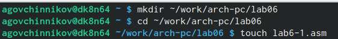{#fig:fig001 width=70%}

Ввожу в файл lab6-1.asm текст из листинга 6.1 (рис. @fig:fig002)

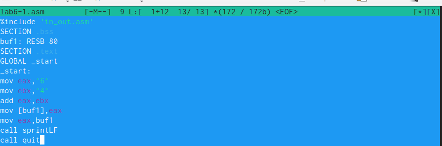{#fig:fig002 width=70%}

Создаю исполняемый файл и запускаю его (рис. @fig:fig003)

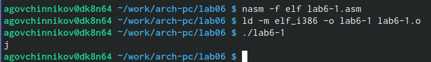{#fig:fig003 width=70%}

Изменяю текст программы, чтобы программа вывела другой результат (рис. @fig:fig004)

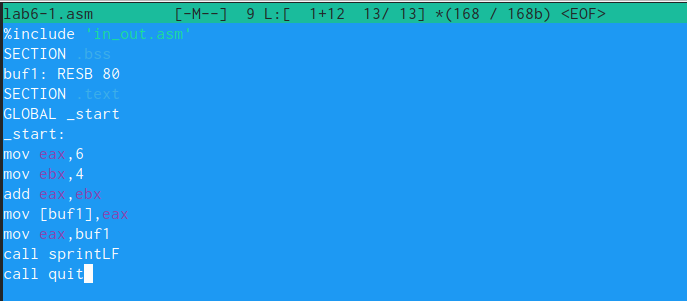{#fig:fig004 width=70%}

Запускаю изменненый файл и смотрю вывод новой команды (рис. @fig:fig005)

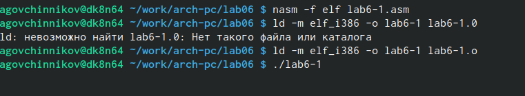{#fig:fig005 width=70%}

Создаю файл lab6-2.asm и ввожу туда текст из листинга (рис. @fig:fig006)

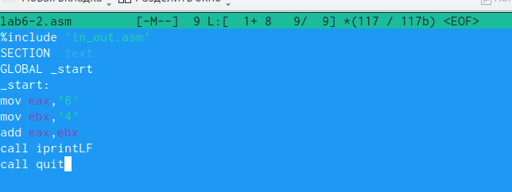{#fig:fig006 width=70%)

Создаю исполняемый файл и запускаю его (рис. @fig:fig007)

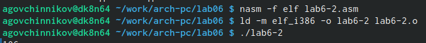{#fig:fig007 width=70%)

Изменяю текст файла и запускаю новую программу (рис. @fig:fig008)

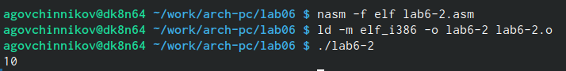{#fig:fig008 width=70%}

Заменяю в тексте файла функцию iprintLF на iprint (рис. @fig:fig009). Вывод не изменился, потому что символ переноса строки не отображался, когда программа исполнялась с функцией iprintLF, а iprint не добавляет к выводу символ переноса строки, в отличие от iprintLF.

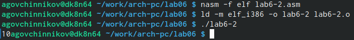{#fig:fig009 width=70%}

Создаю файл lab6-3.asm и ввожу туда текст листинга 6.3 (рис. @fig:fig010)

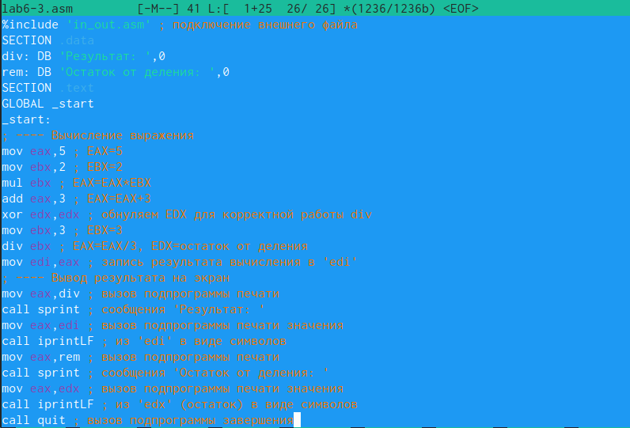{#fig:fig010 width=70%}

Создаю исполняемый файл и запускаю его (рис. @fig:fig011)

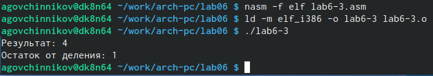{#fig:fig011 width=70%}

Создаю файл variant.asm чтобы узнать номер своего варианта для выполнения самостоятельной работе (рис. @fig:fig012)

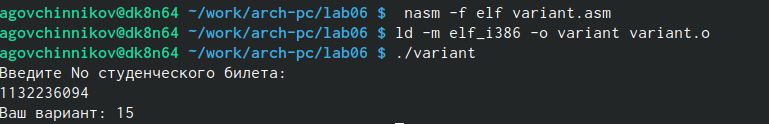{#fig:fig012 width=70%}

#Ответы на вопросы

    1.mov eax,rem
    call sprint
    2. Инструкция mov ecx, x используется, чтобы положить адрес вводимой строки x в регистр ecx mov edx, 80 - запись в регистр edx длины вводимой строки call sread - вызов подпрограммы из внешнего файла, обеспечивающей ввод сообщения с клавиатуры
    3. call atoi используется для вызова подпрограммы из внешнего файла, которая преобразует ascii-код символа в целое число и записывает результат в регистр eax
    4. За вычисления варианта отвечают строки:
xor edx,edx ; обнуление edx для корректной работы div
mov ebx,20 ; ebx = 20
div ebx ; eax = eax/20, edx - остаток от деления
inc edx ; edx = edx + 1
    5. При выполнении инструкции div ebx остаток от деления записывается в регистр edx
    6. Инструкция inc edx увеличивает значение регистра edx на 1
    7. За вывод на экран результатов вычислений отвечают строки:
mov eax,edx
call iprintLF

#Выполнение заданий для самостоятельной работы

Создаю файл lab6-4.asm с помощью команды touch (рис. @fig:fig013)

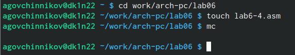{#fig:fig013 width=70%}

Открываю созданный файл и ввожу текст программы, которая решит мое уравнение (рис. @fig:fig014)

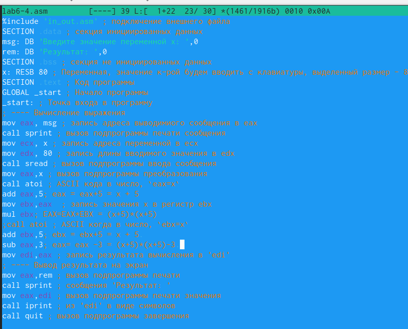{#fig:fig014 width=70%}

Запуск написанной программы (рис. @fig:fig015)

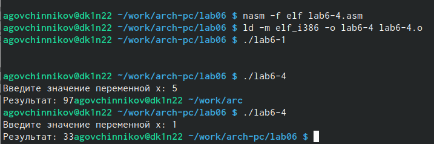{#fig:fig015 width=70%}

#Листинг

```asm
     %include 'in_out.asm'
SECTION .bss
buf1: RESB 80
SECTION .text
GLOBAL _start
_start:
mov eax,'6'
mov ebx,'4'
add eax,ebx
mov [buf1],eax
mov eax,buf1
call sprintLF
call quit 
```


#Выводы

Я освоил арифметические инструкции языка ассемблера NASM.


