---
## Front matter
title: "Лабораторная работа №8"
subtitle: "Архитектура компьютера"
author: "Овчинников Антон Григорьевич"

## Generic otions
lang: ru-RU
toc-title: "Содержание"

## Bibliography
bibliography: bib/cite.bib
csl: pandoc/csl/gost-r-7-0-5-2008-numeric.csl

## Pdf output format
toc: true # Table of contents
toc-depth: 2
lof: true # List of figures
lot: true # List of tables
fontsize: 12pt
linestretch: 1.5
papersize: a4
documentclass: scrreprt
## I18n polyglossia
polyglossia-lang:
  name: russian
  options:
	- spelling=modern
	- babelshorthands=true
polyglossia-otherlangs:
  name: english
## I18n babel
babel-lang: russian
babel-otherlangs: english
## Fonts
mainfont: PT Serif
romanfont: PT Serif
sansfont: PT Sans
monofont: PT Mono
mainfontoptions: Ligatures=TeX
romanfontoptions: Ligatures=TeX
sansfontoptions: Ligatures=TeX,Scale=MatchLowercase
monofontoptions: Scale=MatchLowercase,Scale=0.9
## Biblatex
biblatex: true
biblio-style: "gost-numeric"
biblatexoptions:
  - parentracker=true
  - backend=biber
  - hyperref=auto
  - language=auto
  - autolang=other*
  - citestyle=gost-numeric
## Pandoc-crossref LaTeX customization
figureTitle: "Рис."
tableTitle: "Таблица"
listingTitle: "Листинг"
lofTitle: "Список иллюстраций"
lotTitle: "Список таблиц"
lolTitle: "Листинги"
## Misc options
indent: true
header-includes:
  - \usepackage{indentfirst}
  - \usepackage{float} # keep figures where there are in the text
  - \floatplacement{figure}{H} # keep figures where there are in the text
---

# Цель работы

Приобрести навыки написания программ с использованием циклов и обработкой аргументов командной строки


# Теоретическое введение

Стек — это структура данных, организованная по принципу LIFO («Last In — First Out»
или «последним пришёл — первым ушёл»). Стек является частью архитектуры процессора и
реализован на аппаратном уровне. Для работы со стеком в процессоре есть специальные
регистры (ss, bp, sp) и команды.
Основной функцией стека является функция сохранения адресов возврата и передачи
аргументов при вызове процедур. Кроме того, в нём выделяется память для локальных
переменных и могут временно храниться значения регистров.
На рис. 8.1 показана схема организации стека в процессоре.
Стек имеет вершину, адрес последнего добавленного элемента, который хранится в ре-
гистре esp (указатель стека). Противоположный конец стека называется дном. Значение,
помещённое в стек последним, извлекается первым. При помещении значения в стек указа-
тель стека уменьшается, а при извлечении — увеличивается.
Для стека существует две основные операции:
• добавление элемента в вершину стека (push);
• извлечение элемента из вершины стека (pop).

# Выполнение лабораторной работы

Создаю каталог для программ лабораторной работы №8 и создаю файл lab8-1.asm (рис. @fig:001).

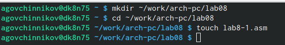{#fig:001 width=70%}

Ввожу в файл текст из листинга 8.1 (рис. @fig:002).

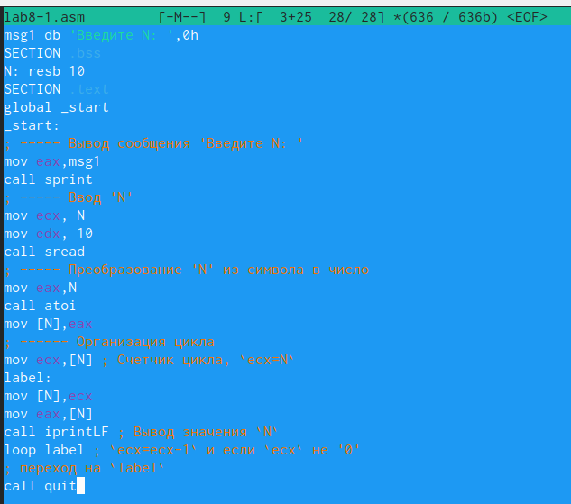{#fig:002 width=70%}

Создаю исполняемый файл и проверяю его работу (рис. @fig:003). В данном случае число проходов цикла не соответствует значению N введенному с клавиатуры.

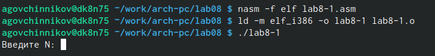{#fig:003 width=70%}

Меняю текст листинга файла и проверяю рузльтат программы (рис. @fig:004). В данном случае число проходов цикла соответствует значению N введенному с клавиатуры.

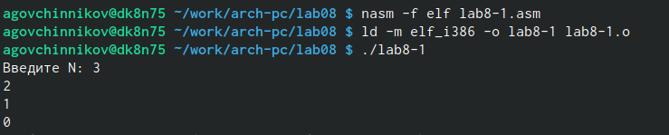{#fig:004 width=70%}

Создаю файл lab8-2.asm и ввожу туда текст из листинга 8.2 (рис. @fig:005).

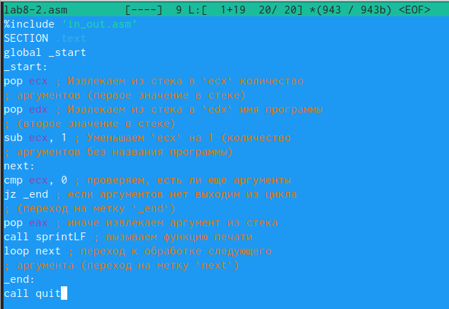{#fig:005 width=70%}

Создаю исполняемый файл и проверяю его работу (рис. @fig:006).

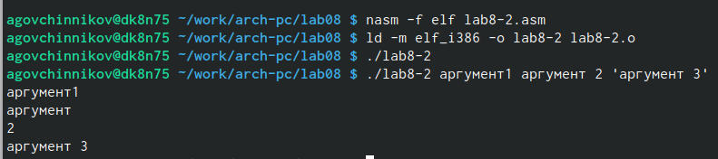{#fig:006 width=70%}

Создаю файл lab8-3.asm и ввожу в него текст программы из листинга 8.3 (рис. @fig:007)

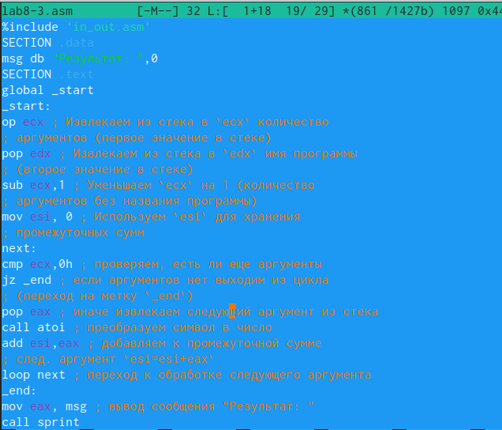{#fig:007 width=70%}

Создаю исполняемый файл и запускаю его, при этом указывая аргументы (рис. @fig:008)

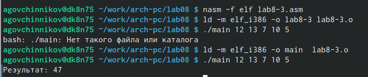{#fig:008 width=70%}

Изменяю текст программы из листинга для вычисления произведения аргументов командной строки (рис. @fig:009)

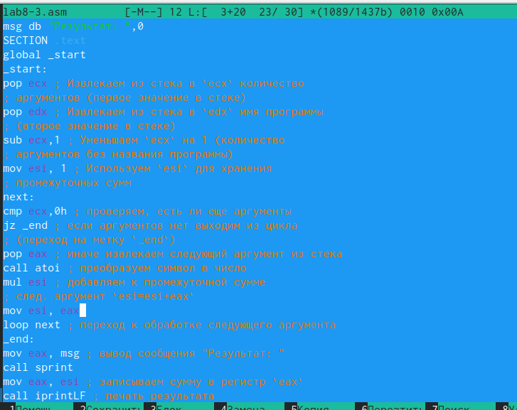{#fig:009 width=70%}

Создаю исполняемый файл и проверяю его работу (рис. @fig:010).

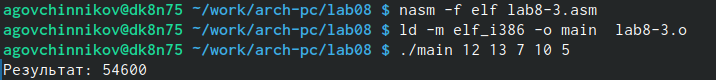{#fig:010 width=70%}

# Задание для самостоятельной работы 

Вариант 15

Пишу программу, которая находит сумму значений функции f(x) (рис. @fig:011).

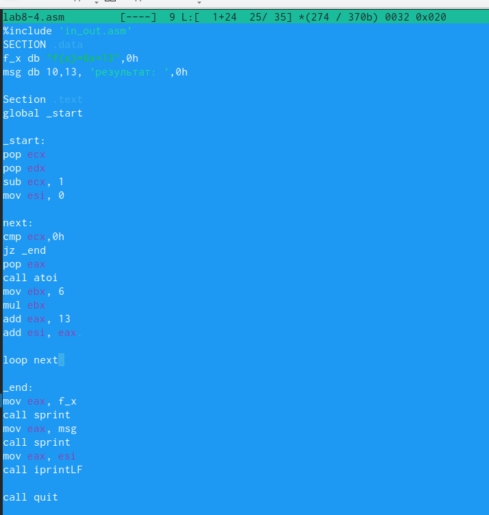{#fig:011 width=70%}

Создаю исполняемый файл и проверяю его работу (рис. @fig:012).

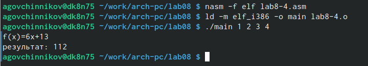{#fig:012 width=70%}


# Листинг 

```
%include 'in_out.asm'
SECTION .data
f_x db "f(x)=6x+13",0h
msg db 10,13, 'результат: ',0h

Section .text
global _start

_start:
pop ecx
pop edx
sub ecx, 1
mov esi, 0

next:
cmp ecx,0h
jz _end
pop eax
call atoi
mov ebx, 6
mul ebx
add eax, 13
add esi, eax 

loop next 

_end:
mov eax, f_x
call sprint
mov eax, msg
call sprint
mov eax, esi
call iprintLF

call quit
```


# Выводы

Я приобрел навыки написания программ с использованием циклов и обраткой аргументов командной строки


