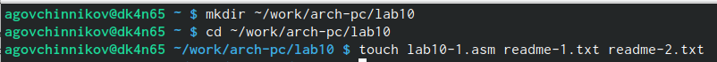
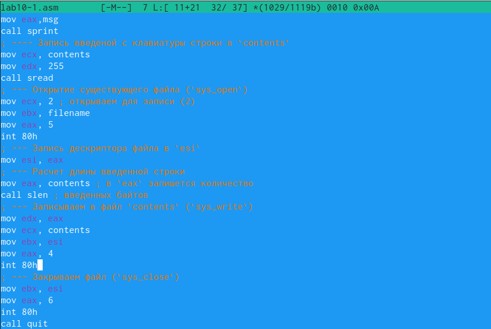
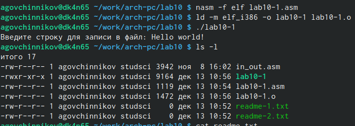
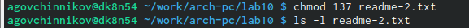
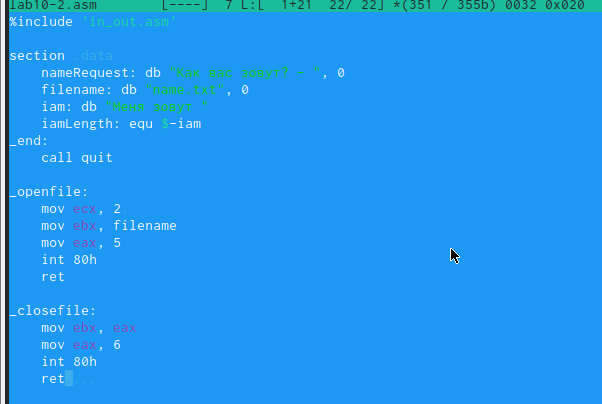
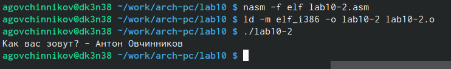

---
## Front matter
title: "Лабораторная работа №10"
subtitle: "Архитектура компьютера"
author: "Овчинников Антон Григорьевич"

## Generic otions
lang: ru-RU
toc-title: "Содержание"

## Bibliography
bibliography: bib/cite.bib
csl: pandoc/csl/gost-r-7-0-5-2008-numeric.csl

## Pdf output format
toc: true # Table of contents
toc-depth: 2
lof: true # List of figures
lot: true # List of tables
fontsize: 12pt
linestretch: 1.5
papersize: a4
documentclass: scrreprt
## I18n polyglossia
polyglossia-lang:
  name: russian
  options:
	- spelling=modern
	- babelshorthands=true
polyglossia-otherlangs:
  name: english
## I18n babel
babel-lang: russian
babel-otherlangs: english
## Fonts
mainfont: PT Serif
romanfont: PT Serif
sansfont: PT Sans
monofont: PT Mono
mainfontoptions: Ligatures=TeX
romanfontoptions: Ligatures=TeX
sansfontoptions: Ligatures=TeX,Scale=MatchLowercase
monofontoptions: Scale=MatchLowercase,Scale=0.9
## Biblatex
biblatex: true
biblio-style: "gost-numeric"
biblatexoptions:
  - parentracker=true
  - backend=biber
  - hyperref=auto
  - language=auto
  - autolang=other*
  - citestyle=gost-numeric
## Pandoc-crossref LaTeX customization
figureTitle: "Рис."
tableTitle: "Таблица"
listingTitle: "Листинг"
lofTitle: "Список иллюстраций"
lotTitle: "Список таблиц"
lolTitle: "Листинги"
## Misc options
indent: true
header-includes:
  - \usepackage{indentfirst}
  - \usepackage{float} # keep figures where there are in the text
  - \floatplacement{figure}{H} # keep figures where there are in the text
---

# Цель работы

Приобрести навыки написания программ для работы с файлами

# Теоретическое введение

ОС GNU/Linux является многопользовательской операционной системой. И для обеспече-
ния защиты данных одного пользователя от действий других пользователей существуют
специальные механизмы разграничения доступа к файлам. Кроме ограничения доступа, дан-
ный механизм позволяет разрешить другим пользователям доступ данным для совместной
работы.
Права доступа определяют набор действий (чтение, запись, выполнение), разрешённых
для выполнения пользователям системы над файлами. Для каждого файла пользователь
может входить в одну из трех групп: владелец, член группы владельца, все остальные. Для
каждой из этих групп может быть установлен свой набор прав доступа. Владельцем файла
является его создатель. Для предоставления прав доступа другому пользователю или другой
группе командо

# Выполнение лабораторной работы
Создаю рабочую директорую, создаю в ней файл в который ввожу текст из листинга (рис. @fig:001).

{#fig:001 width=70%}

{#fig:002 width=70%}

Создаю исполняемый файл и запускаю его (рис. @fig:003).

{#fig:003 width=70%}

С помощью команды chmode изменяю права доступа к файлу readme-2.txt в соответсвии с вариантом.  С помощью команды ls -l убеждаюсь в правильности выполнения задания. (рис. @fig:004).

{#fig:004 width=70%}

# Выполнение самостоятельной работы

Создаю файл lab10-2.asm в который ввожу текст программы,которая спрагивает как меня зовут. (рис. @fig:005)

{#fig005 width=70%}

Создаю исполняемый файл и запускаю его (рис. @fig:006)

{#fig006 width=70%}

# Выводы

Я приобрел навыки написания программ для работы с файлами

